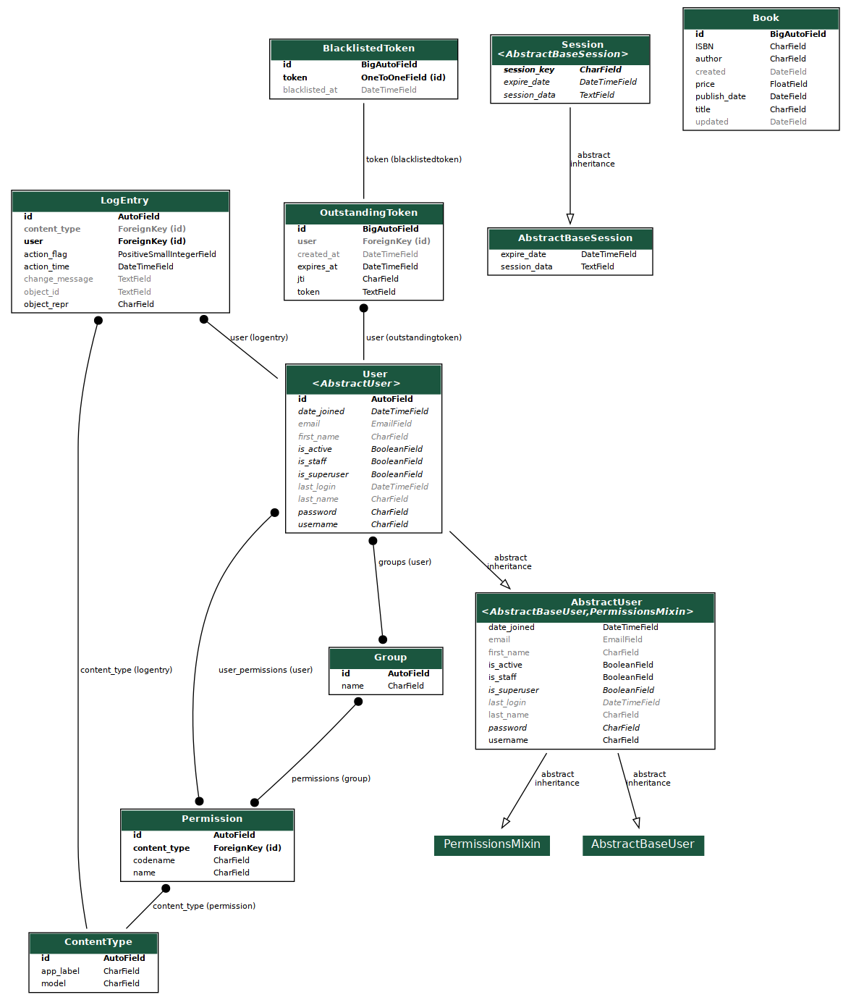

# Resola Challenge

## Installation steps

1. Ensure you have python3.7 installed

2. Install the dependencies using `pip install -r requirements.txt`

3. Collect static UI `python manage.py collectstatic`

4. Migrate existing db tables by running `python manage.py migrate`

5. Run unittest `python manage.py test -v 2`

6. Run the django development server using `python manage.py runserver`

## System Diagram

## Testing API

1. Using swagger for testing: *http://127.0.0.1:8000/swagger/*

2. For authentication. Please register then login. Click the Authentication button on Swagger UI. The value will be: **Bearer <access token>**

3. `/book/`/ API can be accessed by anyone using the GET method. If you want to add a new Book or change Book info using POST, PUT method, you need to have authentication.

4. For authentication, you can register a new account using `/authentication/register/` API. Login `/authentication/login/` and get *access_token*. Add it in header request as format **Authorization: Bearer access_token** and you will be granted access to authorized endpoints.

## Deployment

This project is deployed in Pythonanywhere. You can check [this endpoint](https://duong22.pythonanywhere.com/swagger/) for live testing.